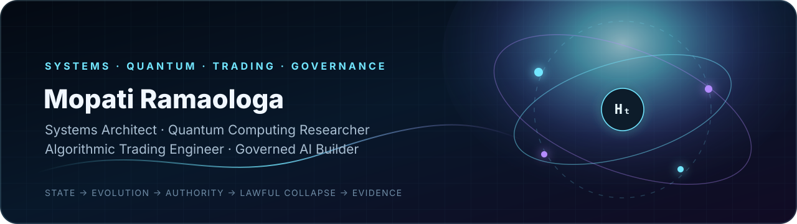

<p align="center">
  
</p>

<h1 align="center">Mopati Ramaologa</h1>
<p align="center"><strong>Systems Architect · Quantum Computing Researcher · Algorithmic Trading Engineer · Governed AI Builder</strong></p>
<p align="center">Gaborone, Botswana · Building complete systems where authority, execution, verification and evidence remain explicit.</p>

<p align="center">
  <a href="https://mopati123.github.io/mopati-portfolio/">Interactive portfolio</a>
  ·
  <a href="https://github.com/Mopati123?tab=repositories">Repositories</a>
  ·
  <a href="https://github.com/Mopati123/hpl-spec">HPL</a>
  ·
  <a href="https://github.com/Mopati123/universal-hamiltonian-framework">Hamiltonian research</a>
</p>

---

## What I build

I work across mathematical models, software architecture, infrastructure, databases, interfaces and operational proof. The common execution law is:

```text
State → Evolution → Constraints → Measurement → Authority
      → Lawful collapse or refusal → Reconciliation → Evidence
```

My engineering focus spans:

- **Quantum computing research** — Hamiltonian evolution, state spaces, operators, trajectory ensembles, measurement and hybrid classical/quantum architectures.
- **Algorithmic trading systems** — market geometry, time, information, portfolio evolution, risk, execution and governance as independent but coupled state domains.
- **Governed AI and agents** — proposal capability separated from execution authority, with typed refusal and evidence-native operation.
- **Financial and economic platforms** — consent, identity, finance workflows, reconciliation, persistence and auditability.
- **Production software systems** — Python, FastAPI, PostgreSQL, TypeScript, Next.js, Flutter, CI/CD and infrastructure operations.

## Flagship public systems

| System | Purpose | Public status |
|---|---|---|
| **[Hamiltonian Programming Language](https://github.com/Mopati123/hpl-spec)** | Scheduler-governed execution substrate with typed refusal, deterministic evidence, signatures and cryptographic anchoring. | Active public specification and reference runtime; 405+ test snapshot. |
| **[Universal Hamiltonian Framework](https://github.com/Mopati123/universal-hamiltonian-framework)** | Research framework for phase space, Hamiltonian evolution, symplectic structure, domain modelling and invariant validation. | Active research; standard mathematics is separated from experimental cross-domain hypotheses. |
| **[Engineering Portfolio](https://github.com/Mopati123/mopati-portfolio)** | Public observer surface for quantum, trading, governance, finance and platform engineering. | Deployed through validated GitHub Pages workflows. |
| **[Governance Divergence Engine](https://github.com/Mopati123/duma-boko-contradiction-engine-v2)** | Source-traceable evidence collection and promise/outcome divergence analysis. | Active public research and evidence tooling. |
| **[Codebase Prompting](https://github.com/Mopati123/codebase-prompting)** | Repository traversal and context packaging for AI-assisted software analysis. | Public utility and experimentation repository. |

## Private implementation programmes

These systems exist, but their source, operations or sensitive domain logic remain controlled:

- **ApexQuantumICT** — governed multi-Hamiltonian algorithmic trading operating system.
- **Easy Banking OS** — consent-governed, cross-platform financial operating system.
- **PulaFeed** — Botswana agriculture network and livestock-finance coordination prototype.
- **Thulie’s Corner / Roxie’s Closet OS** — retail catalogue, ordering, payment-proof, inventory and operational governance platform.

Public claims for private systems are restricted to architecture, dated validation snapshots and explicitly disclosed boundaries.

## Current research programme

### Quantum computation without qubits

A classical substrate that preserves selected quantum-computational structures through multi-trajectory evolution, constraint coupling, information measurement, scheduler selection and lawful collapse.

> **Truth boundary:** this is quantum-inspired and Hamiltonian computation on classical hardware, not a demonstrated physical quantum computer or proven quantum speed-up.

### ApexQuantumICT

```text
Market data
→ H_market
→ H_time
→ H_information
→ H_portfolio
→ H_risk
→ H_execution
→ H_governance
→ Execute or refuse
→ Evidence
```

> **Trading boundary:** no claim of guaranteed profitability, autonomous live execution, broker connectivity or live-fund performance is made without project-specific evidence.

## Engineering invariants

- **Invariant-first:** define valid states and forbidden transitions before implementation.
- **Refusal-first:** invalid or unauthorized operations produce typed refusal rather than silent fallback.
- **Scheduler sovereignty:** analysis and agents may propose; independent authority controls execution.
- **Evidence-native:** tests, manifests, signatures, audit trails and reconciliation artifacts are first-class outputs.
- **Truth-bounded:** implemented, validated, experimental, private and planned capabilities are labelled separately.

## Core stack

`Python` · `FastAPI` · `PostgreSQL` · `SQLite` · `TypeScript` · `Next.js` · `Flutter` · `JAX` · `NumPy` · `GitHub Actions` · `Docker` · `Linux` · `WSL2`

## Evidence model

| Evidence class | Meaning |
|---|---|
| **Implemented** | A named code path exists in a repository. |
| **Validated** | A reproducible test, command or CI run supports the behaviour. |
| **Research** | Formal or computational investigation remains active. |
| **Private** | The implementation exists but public access is restricted. |
| **Planned** | A roadmap item that must not be described as current capability. |

## Connect

The best entry point is the **[interactive engineering portfolio](https://mopati123.github.io/mopati-portfolio/)**. It presents each system through its problem, architecture, authority boundary, evidence and current limitations.

<p align="center"><sub>Architecture is not merely how a system works. It is also what the system is allowed to do, who may authorize it, how it refuses, and how another observer can verify the result.</sub></p>
